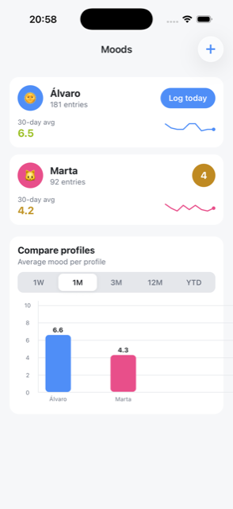
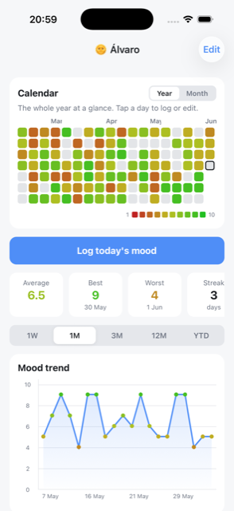
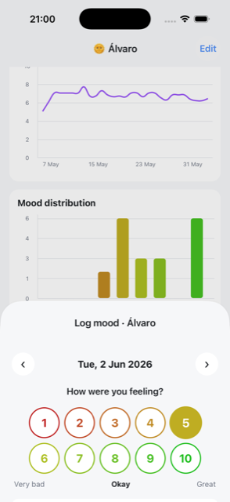

<div align="center">


# MoodCounter

**A private, local-first mood tracker for iPhone.**
Track how you (and the people around you) feel — one number a day, 1 to 10.

[](https://expo.dev)
[](https://reactnative.dev)
[](https://www.typescriptlang.org)
[](https://docs.expo.dev/versions/latest/sdk/sqlite/)
[](#-install-on-your-iphone)

</div>

---

## ✨ Why

No accounts. No cloud. No analytics. **Everything lives in a SQLite database on your phone.**
Create a profile per person, log a daily mood on a 1–10 scale (1 = very bad, 10 = great) with an optional note, and watch the patterns emerge.

## 📱 Screenshots

| Overview & comparison | Profile focus view | Daily logging |
| :---: | :---: | :---: |
|  |  |  |
| Profile cards with today's mood, 30-day average, sparkline & cross-profile comparison | Year-to-date calendar heatmap, stat tiles, finance-style ranges & trend charts | Tap a number, add a note — colored 1→10 scale with haptics |

## 🧩 Features

- **👥 Multiple profiles** — a name, a color, an emoji. No sign-ups, no passwords.
- **🗓 Year-at-a-glance calendar** — GitHub-style heatmap of the whole year to date, every day colored red → green by mood. Tap any day to log or edit. A swipeable month view is one toggle away.
- **📈 Finance-style analytics** — switch between `1W · 1M · 3M · 12M · YTD`:
  - Mood trend line (data points colored by mood)
  - 7-day moving average
  - Mood distribution histogram
- **🔢 Stats per profile** — average, best & worst day, logging streak, entry count.
- **⚖️ Compare profiles** — side-by-side average mood and entry counts over any range.
- **✏️ One entry per day** — re-logging a day edits it (SQLite upsert on `UNIQUE(profile_id, date)`).
- **📴 Fully offline** — works in airplane mode forever; your data never leaves the device.

## 🛠 Tech stack

| Layer | Choice |
| --- | --- |
| Framework | [Expo SDK 56](https://expo.dev) · React Native 0.85 · TypeScript (strict) |
| Navigation | [expo-router](https://docs.expo.dev/router/introduction/) (file-based) |
| Storage | [expo-sqlite](https://docs.expo.dev/versions/latest/sdk/sqlite/) — schema migrations via `PRAGMA user_version` |
| Charts | [react-native-gifted-charts](https://github.com/Abhinandan-Kushwaha/react-native-gifted-charts) |
| Calendar | [react-native-calendars](https://github.com/wix/react-native-calendars) + custom year grid |
| Dates | [date-fns](https://date-fns.org) |

```
src/
├── app/            # expo-router screens: overview, profile/[id], log/[id] (modal)
├── components/     # MoodScale, YearGrid, charts, cards, …
├── db/             # SQLite schema, profiles/entries CRUD, stats queries
├── hooks/          # useProfiles, useProfileStats, useEntry, useRefreshOnFocus
├── lib/            # mood color scale, day keys, range definitions
└── theme/          # color tokens
```

## 🚀 Getting started

> **Prerequisites:** macOS with Xcode (full app, not just CommandLineTools), Node 20+.

```bash
git clone git@github.com:balalofernandez/moodcounter.git
cd moodcounter
npm install
npx expo run:ios            # builds & launches in the iOS Simulator
```

No `.env`, no secrets, no backend — the clone is everything.

> If the CLI claims *"Xcode must be fully installed"*, point the developer tools at Xcode:
> `sudo xcode-select -s /Applications/Xcode.app/Contents/Developer`

## 📲 Install on your iPhone

1. **One-time signing setup** — open `ios/moodcounter.xcworkspace`, add your Apple ID (Xcode ▸ Settings ▸ Accounts), then on the *moodcounter* target enable *Automatically manage signing* and pick your **Personal Team**.
2. Plug in your iPhone and run:
   ```bash
   npx expo run:ios --device --configuration Release
   ```
3. On the phone: enable **Developer Mode** (Settings ▸ Privacy & Security) and **trust the certificate** (Settings ▸ General ▸ VPN & Device Management).

> ⏳ **Free Apple ID caveat:** the signature expires every **7 days** — just re-run step 2 to re-sign (data is preserved). A paid Apple Developer account extends this to 1 year.

## 🎨 The mood scale

A single color function drives the whole UI — calendar cells, scale pills, chart points:

```
1 ─────────── 5 ─────────── 10
🔴 red       🟡 amber      🟢 green     (HSL hue 0° → 120°)
```

## 📄 License

Personal project — do whatever makes you happy. 🙂❤️
